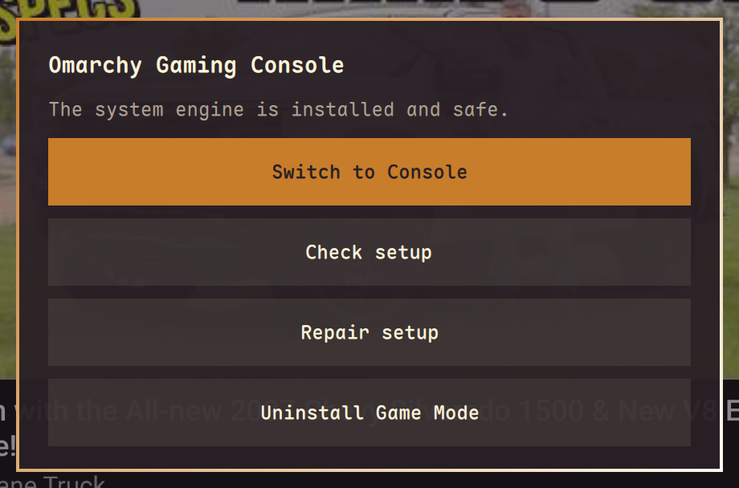

# Omarchy Gaming Console

**Now You’re Playing With Omarchy!**

[](https://x.com/scottito22)

Omarchy Gaming Console gives your computer a **Steam Box-like experience**: a TV-friendly, controller-focused interface in a temporary, exclusive Gamescope/Steam session that returns safely to a fresh stock Omarchy desktop. It is **not** merely Steam Big Picture running inside Hyprland: the Console session replaces the desktop compositor for the visit, then gives control back to Omarchy.


## First-time setup

Requires an Omarchy 4 Quattro desktop, a supported x86_64 Gamescope/Steam graphics stack, and permission to authorize system setup locally. Save your work before switching sessions.

### Install the signed engine helper

The privileged lifecycle helper is deliberately **not** installed from the plugin checkout. You do not need to download its three release files by hand. Use GitHub’s **Copy** button on the block below, paste the whole block into your terminal once, and press **Enter**. It downloads all three fixed-name assets, checks the signing-key fingerprint and detached signature, and asks for local authorization only when pacman installs the verified package.

```bash
bash <<'OGC_ENGINE_INSTALL'
set -euo pipefail

work=$(mktemp -d)
trap 'rm -rf "$work"' EXIT
cd "$work"

base=https://github.com/jcarcinogen/omarchy-gaming-console/releases/latest/download
fresh=$(date +%s%N)
deadline=$((SECONDS + 600))

download_asset() {
  local output=$1 max_bytes=$2 url=$3 remaining size
  remaining=$((deadline - SECONDS))
  (( remaining > 0 )) || { printf 'Download deadline exceeded. Nothing was installed.\n' >&2; exit 1; }
  curl --proto '=https' --proto-redir '=https' --tlsv1.2 --fail --silent --show-error --location \
    --connect-timeout 30 --max-time "$remaining" --max-filesize "$max_bytes" \
    --output "$output" "$url"
  size=$(stat -c %s -- "$output")
  (( size > 0 && size <= max_bytes )) || {
    printf 'Downloaded asset exceeded its committed size ceiling. Nothing was installed.\n' >&2
    exit 1
  }
}

download_asset omarchy-gaming-console-engine-any.pkg.tar.zst 1048576 \
  "$base/omarchy-gaming-console-engine-any.pkg.tar.zst?fresh=$fresh"
download_asset omarchy-gaming-console-engine-any.pkg.tar.zst.sig 16384 \
  "$base/omarchy-gaming-console-engine-any.pkg.tar.zst.sig?fresh=$fresh"
download_asset omarchy-gaming-console-engine-signing-key.asc 65536 \
  "$base/omarchy-gaming-console-engine-signing-key.asc?fresh=$fresh"

fingerprint=$(gpg --show-keys --with-colons omarchy-gaming-console-engine-signing-key.asc | awk -F: '$1 == "fpr" { print $10; exit }')
[[ $fingerprint == 5F080326EB4583CA063F9CA56E6DF2952E09D28D ]] || {
  printf 'Signing-key fingerprint mismatch. Nothing was installed.\n' >&2
  exit 1
}
gpg --import omarchy-gaming-console-engine-signing-key.asc
gpg --verify omarchy-gaming-console-engine-any.pkg.tar.zst.sig omarchy-gaming-console-engine-any.pkg.tar.zst
sudo pacman-key --add omarchy-gaming-console-engine-signing-key.asc
sudo pacman-key --lsign-key 5F080326EB4583CA063F9CA56E6DF2952E09D28D
sudo pacman -U ./omarchy-gaming-console-engine-any.pkg.tar.zst < /dev/tty
OGC_ENGINE_INSTALL
```

The three fixed-name assets downloaded by that block are:

- `omarchy-gaming-console-engine-any.pkg.tar.zst`
- `omarchy-gaming-console-engine-any.pkg.tar.zst.sig`
- `omarchy-gaming-console-engine-signing-key.asc`

The expected signing-key fingerprint is `5F08 0326 EB45 83CA 063F 9CA5 6E6D F295 2E09 D28D`. If either the fingerprint or signature is wrong, the block stops before package installation. Pacman then verifies the same detached signature. The package installs the root-owned helper and its narrow polkit policy. The helper itself fixes the one marketplace-reviewed 40-character commit it may fetch and execute; the plugin cannot supply or replace that identity.

### Install the front end

From an Omarchy desktop terminal, add and enable the front end:

```bash
omarchy plugin add https://github.com/jcarcinogen/omarchy-gaming-console.git --enable
```

1. Review the plugin trust prompt and choose a bar location (default: **right**).
2. If the signed helper is not installed yet—as with a marketplace-first install—the controller overlay shows **Engine Helper Required** instead of attempting setup. Click **Open installation instructions**; a visible terminal gives you this README link and tells you to copy the single block above. Install it, then reopen the overlay.
3. Click **Install Game Mode**. Follow the visible terminal and local authorization prompts. Setup installs missing Gamescope, Steam and MangoHud dependencies through Omarchy's helpers, then asks only the package-owned Console engine manager to install the system engine. OGC does not install or update third-party Steam compatibility tools; Steam continues to manage Valve Proton normally.
4. Once status is **ready**, save your work and choose **Switch to Console**. This ends the desktop session; Steam may take a while to appear on first launch. Sign in locally if Steam asks.
5. To return, use Steam's **Power → Switch to Desktop**. Omarchy remains the normal boot destination.

If setup fails, keep the error output and use **Repair** after resolving the reported problem rather than assuming setup succeeded.

## Using the front end

Look for the **controller glyph on the right side of the Omarchy bar**. It opens one overlay for setup, status, repair, uninstall, and switching to Console.



The plugin and the privileged system engine remain separate:

- `omarchy plugin add` installs only the Quattro front end.
- **Install Game Mode** invokes only `/usr/lib/omarchy-gaming-console/engine-manager`, supplied by the separately installed signed Arch package. That root-owned helper pins one exact reviewed commit and does not accept code, URLs, repositories, digests, or commits from the plugin folder.
- Removing the plugin does not silently uninstall system files.
- **Uninstall Game Mode** removes only the engine objects recorded as owned by this project.

The fixed CLI bundled with the plugin accepts only:

```text
omarchy-gaming-console status [--json]
omarchy-gaming-console setup
omarchy-gaming-console switch
omarchy-gaming-console repair
omarchy-gaming-console uninstall
```

`status --json` is the plugin’s sole state source. `switch` refuses unless the complete engine is installed and safe, then presents the unsaved-work warning before invoking only the installed fixed `pkexec` helper.

## v1 scope

- **Desk-only:** Omarchy is always home; Console is a temporary visit.
- Setup is explicit and visible because the session and display-manager integration requires privileged system changes.
- The fixed SDDM request exists only under boot-volatile `/run`; the packaged `omarchy.desktop` and `autologin.conf` remain unchanged.
- The exact ARM64 Try Omarchy fixture uses its reviewed Hyprland/foot dummy boundary. A VM `ready` result does not claim physical Gamescope or Steam readiness.

## Performance overlay

Hardware setup installs Arch’s `mangohud` package through the official Omarchy package helper. Its `mangoapp` compositor overlay is launched by Gamescope with `--mangoapp`; Steam’s performance-overlay level controls it. No global `MANGOHUD=1`, library injection, game launch-option edits, or extra 32-bit overlay package is required for this compositor path. Hardware readiness requires `mangoapp`; the ARM VM dummy boundary does not claim an overlay test. Engine uninstall preserves package-managed dependencies such as Steam, Gamescope and MangoHud, and never deletes their package files.

## Display settings

Use Steam's **Settings → Display** in Console. **Automatically Set Resolution** selects the automatic/native mode; turn it off to choose an advertised resolution and refresh rate, then use **Keep** or **Revert**. The confirmation countdown also provides recovery. Automatic mode is not guaranteed to select your display's highest refresh rate.

Native choices are saved as user-owned preferences in `~/.config/omarchy-gaming-console/modes.cfg` (or beneath `$XDG_CONFIG_HOME`). They survive Console visits and engine uninstall. Manual 4K120, Keep/Revert/timeout and reboot persistence were verified on the AMD target; that is not a guarantee for every display. HDR and VRR are not enabled by this project.

### Advanced startup display preference

Gamescope may choose the display’s preferred 60 Hz mode even when the desktop uses 120 Hz. To request a supported mode explicitly, create `$XDG_CONFIG_HOME/omarchy-gaming-console/display-mode` (normally `~/.config/omarchy-gaming-console/display-mode`) containing one line of three positive integers: width, height, and refresh rate. Example for a display already verified at 4K120:

```text
3840 2160 120
```

This is data, not a shell script: no extra flags or commands are accepted. It supplies only Gamescope `-W`, `-H`, and `-r`. Without the file, Gamescope keeps its defaults. Only request a mode supported by your display; unsupported requests may fall back in Gamescope, so verify the actual output. HDR and VRR are not enabled by this preference. The preference is user-owned and preserved by engine uninstall; delete this one file to restore default selection. The VM dummy path ignores it.

## Updates and known limitation

Update Omarchy through **Omarchy’s Update process on the desktop**, not Steam’s **Settings → System → Check For Updates**.

Steam’s check may display **“Update error”** because it also attempts unsupported Steam Deck firmware checks. This is a known, accepted limitation of the Console interface; it does not mean Omarchy’s updater failed. Dismiss the popup and use the desktop update process for Omarchy packages.

Steam client self-updates are separate. The Console OS helper does not check Omarchy package freshness or install OS updates. BIOS/firmware updates remain hardware-specific; this project does not manage them or promise that Omarchy Update covers them.

## Uninstall

Return to the Omarchy desktop first. Open the controller overlay and choose **Uninstall Game Mode**, then complete the visible authorization. Do this **before removing the plugin**, which contains the uninstall entry point.

Then remove the front end separately:

```bash
omarchy plugin remove io.github.jcarcinogen.gaming-console
```

Uninstall preserves package-managed dependencies, your games, Steam compatibility tools, Steam mappings and display preferences.

## Recovery

If Console, the greeter, or a transition is stuck, press **Ctrl+Alt+F3**, sign in, and run:

```bash
sudo rm -f /run/omarchy-gaming-console/sddm-oneshot.conf
sudo systemctl reset-failed sddm
sudo systemctl restart sddm
sudo rmdir -- /run/omarchy-gaming-console
```

An already-absent runtime directory needs no cleanup. If it is non-empty, preserve its contents and investigate. See [`docs/rescue.md`](docs/rescue.md) for recovery and [verification summary](docs/verification.md) for current verification evidence and open gates.

## Independence

This is an independent community project. It is not affiliated with, endorsed by, or certified by Valve, Nintendo, or the Omarchy project.

## Development baseline

See [architecture and verification](docs/verification.md) for the routing design, test command, evidence scope and remaining release gates.

## License

[MIT](LICENSE)
